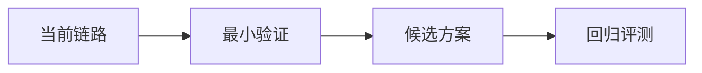

# Synthesis — <痛点一句话>

## 方案 × 环节 Trade-off 矩阵

| Intake 原子问题 / 链路环节 | 候选方案 [paper-id] | 关键机制 | 适配判断 | 可适用性 |
|---|---|---|---|---|
| | | | | |

## 时间线 / 演进

| 年 | 工作 [paper-id] | 相比前序解决的限制 | 仍存限制 |
|---|---|---|---|
| | | | |

## 痛点映射

| Intake 原子问题 | 答案 / 未找到 | 证据 [paper-id] | 推断与不确定性 |
|---|---|---|---|
| | | | |

## 推荐方案路线

<有沉淀价值时给出带 [paper-id] 的 mermaid 流程图;否则说明为何不画>

## 开放问题

- <尚无论文证据或需要工程实验回答的问题>

## 闸门

- [ ] 每篇 T0/T1 至少在 Trade-off 矩阵出现一次
- [ ] 每个 Intake 原子问题已有答案或明确标注"未找到"
- [ ] 事实性结论全部挂 [paper-id]，其余明确标注"推断"
