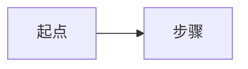

# 调研简报 — <痛点一句话>

- 日期 / slug:<YYYY-MM-DD>-<slug>
- 知识库:`<research-root>/<date>-<slug>/`

## 记分卡

| 覆盖度 | 引用密度 | 未支持声明 | 可操作性 | 完整性 | 校准度 |
|---|---|---|---|---|---|
| x/x | x% | 0 | ✅/❌ | x/x | 待人工回填 |

> ⚠️ 未过闸警告:<如有,在此标出未过闸维度 + 对应章节名;无则删此行>

## 运行指标（非质量闸门）

| 总 token | T0+T1 | 抽取卡数 | 每篇抽取卡 token | 每篇入选论文总 token |
|---|---|---|---|---|
| | | | | |

## 结论(一页)

<直接回答痛点:主要成因是什么 + 推荐方案路线,逐条挂 [paper-id]>

## 方案路线

<mermaid 流程图(有沉淀价值时)+ 分步说明:先做什么、后做什么、依赖与风险>

## 证据

### Trade-off 矩阵

### 时间线 / 演进

### 分原子问题详述

## 风险与开放问题

## 可追溯矩阵

| Intake 问题 | 论文 [paper-id] | 关键证据 | 可适用性 | 结论 |
|---|---|---|---|---|
| | | | | |

## Token 台账摘要

<各阶段花费一行汇总，无法计量时标注“不可得”，详见 ledger.md>
